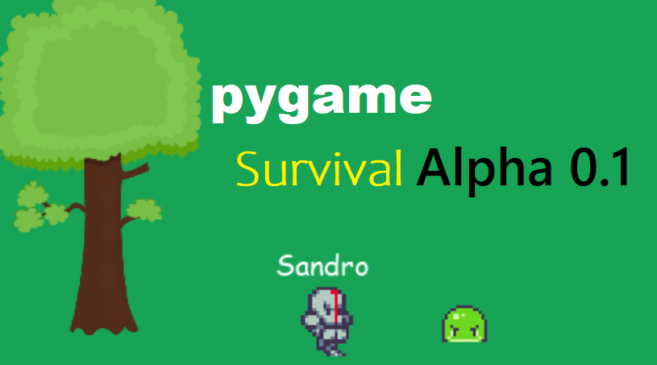

# pygame_roguelike
Action roguelike in python with pygame engine.

# PLANING

## Next to implement
- player Items

## Soon 
- Better map design and less randomness 
- Enemies keep distance to each other
- better main menu 
- Leaderboard 
- map borders
- class to manage font styles 
- Enemies get different velocities on axis (snake is get better vertical speed)

## later
- Support for different resolutions and full screen 
- Save games 

## Maybe later
- Build system
- Controller support
- Multiplayer

# Bugs
- Sometimes enemy tremble because the change direction on each frame.
- player projectiles move with the player.
- No third try when playing (Respawn player Bug).

## Done (but still not perfect)
- Health bars 
- better movement AI
- Monsters do not spawn off-screen - FIXED 
- Collision with player is buggy - FIXED
- Debug view, coordinates over object and more info
- more env objects (like trees)
- pysics, knock-back
- enemy projectiles 
- Kill projectiles that are out of the map - FIXED
- fixed map size
- different projectiles 
- Better peng sound

# Thanks for the inspiration
[ScriptLine Studios - Pygame Top Down Shooter Tutorial](https://youtu.be/sVbFS9qEl4Y)
