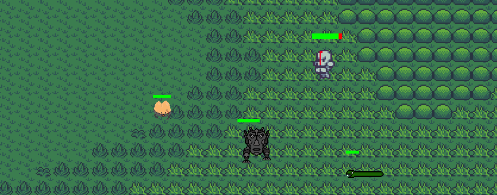

# 2D Action Survival Game 
This project is a small game in Python and shows my first steps with Pygame and game development in general. 
The game can be classified as action roguelike, uses pixel graphics and is in 2D.
It is still under development but the following features are already available: 
- The map is procedurally generated for each game. 
- Camera scrolling and a debug view.
- The player as well as some enemies can shoot projectiles, these have a knock back. 
- There are items that are dropped by enemies and can be collected by the player to restore life. 
- There are different game AI and the enemies try not to get too close.
- The game can summon NPC characters to assist you. 

## How to play 
- You move with W,A,S and D. 
- With left click you shoot projectiles.
- With right click you summon helpers.

At the moment the game is not really at a level where it is challenging or fun in the long run. 

## How to install 
Install the pip packets listed in the `requirements.txt` and run `play.py`. 

## Thanks for the help  
- Sascha - has contributed some code.
- Dennis -  played the background music by himself. 
- Tobi - painted a few enemies. 

Any kind of help is welcome.